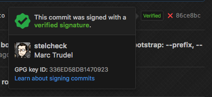

git-signed
==========

Scan a git repository and make sure all commits are signed.

Why?
----

Signing your commits ensure:

  1. That your commits cannot be re-edited by someone esle (using git commit --amend)
  2. That no one cant impersonate you and try to add commits to a codebase

On GitHub PRs, signed commit will have a "verified" badge attached to them.



However, you will most likely want to make sure that all commits
in your repository are signed. It is a good practice for developer,
and an important safety precaution for your projects. This package
can be used as a CI step to make sure that submitted commits are all
signed.

How do I sign my commits?
-------------------------

  * [Signing your work](https://git-scm.com/book/en/v2/Git-Tools-Signing-Your-Work)
  * [Automatically signing all your commits](http://stackoverflow.com/a/20628522/262831)

You will need to upload your GPG key on GitHub for your commits to be marked as verified:
Go to [https://github.com/settings/keys](https://github.com/settings/keys) and add your
key under GPG keys.

Installation
------------

```shell
npm install --save-dev git-signed
```

Usage
-----

In `package.json`:

```json
{
  "scripts": {
    "test": "git-signed"
  }
}
```

Alternatively, if you were previously accepting unsigned commits and now want to
enforce signature, you can pass a commit hash as a first argument to tell `git-signed`
not to look past that commit.


```json
{
  "scripts": {
    "test": "git-signed 86ce8bc"
  }
}
```

Note that `git-signed` will only scan commits in the current branch.

License
-------

MIT.
