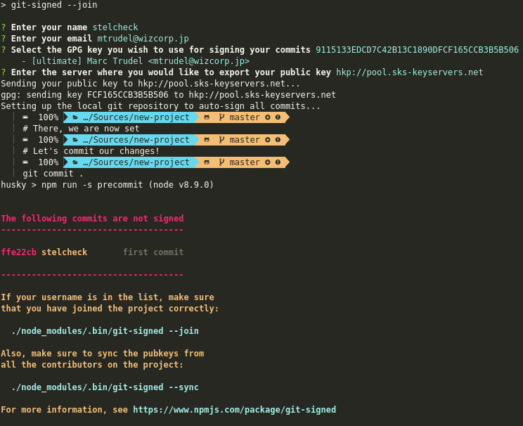
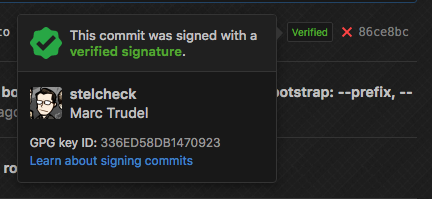
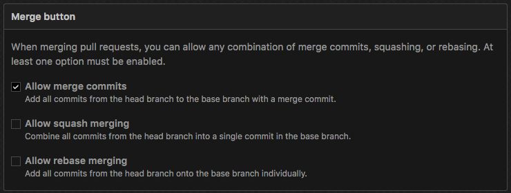

[](https://github.com/Wizcorp/git-signed/releases/latest)
[](https://www.npmjs.com/package/git-signed)
[](https://www.npmjs.com/package/git-signed)

Why?
----

Signing your commits ensure:

  1. That your commits cannot be re-edited by someone else (using git commit --amend)
  2. That no one cant impersonate you and try to add commits to a codebase

However, getting started with commit signing is often a tedious process. Many developers
still do not sign their commits despite both GitHub and GitLab promoting its use. 

Also, without having imported the public key of collaborators on the project, you
will not be able to confirm that their commits are indeed signed. This means that locally
(either during development or on a CI server), you will likely not have a straightforward
way to verify and ensure that all commits in your repository are indeed signed.

git-signed solves both problems by providing a workflow for creating, 
publishing, and locally syncing GPG keys. It also configures 
the local repository to automatically sign all commits with the selected
key.

Requirements
------------

You will need `gpgme` installed locally on your machine.

  - Arch Linux: `pacman -S gpgme` or `yaourt -S gpgme`
  - Ubuntu: `apt-get install gpgme`
  - macOS: `brew install gpgme`

Windows users do not need to install gpgme, we will be using
the copy of gnupg that is installed alongside `git`.

Installation
------------

```shell
npm install --save-dev git-signed
```

Usage
-----

[](https://asciinema.org/a/149115)

[Click here to see our tutorial](https://asciinema.org/a/149115)

In `package.json`:

```json
{
  "scripts": {
    "collaborator:join": "git-signed --join",
    "collaborator:export-key": "git-signed --export",
    "collaborator:sync-keys": "git-signed --sync",
    "test:commit-signatures": "git-signed"
  }
}
```

Then, add yourself as a collaborator. This will add a `collaborators` entry
in you `package.json` file that will be augmented with information about
how to fetch your key.

```shell
npm run collaborator:join
```

On GitHub and GitLab PRs, signed commit will have a "verified" badge attached to them.



To add your GPG key to GitHub, GitLab, or other systems, export your key.

```shell
npm run collaborator:export-key
```

As collaborators join the project, more `collaborators` entries will be added
to your `package.json`. You will need to fetch their keys so to see their 
commits as properly signed.

```shell
npm run collaborator:sync-keys
```

Once you have synced the keys to your localk keyring, you can now
test that all commits are indeed signed.

```shell
test:commit-signatures
```

In some cases, you will want to start checking for signed
commits only from a certain point in history (for instance, if all previous
commits on the project were not signed until this point). Adding a commit
short hash to the `git-signed` command will ignore all previous commits
in your commit tree.

```json
{
  "scripts": {
    "test:commit-signatures": "git-signed 86ce8bc"
  }
}
```

Finally, note that `git-signed` will only scan commits in the current branch.
To scan another branch, simply switch to it, and run git-signed again.

Integrating with Husky
----------------------

Husky allows for the automated setup of commit hooks. One common use
of git-signed is to add a post-commit test to let developers know that they
need to sign their work.

```json
{
  "scripts": {
    "precommit": "npm run test",
    "postcommit": "npm run test:commit-signatures",
    "postmerge": "npm install && npm run collaborator:sync-keys",
    "update": "npm install && npm run collaborator:sync-keys"
  }
}
```

You may find a more complete example in the [package.json](./package.json) file
of this project.

Repository configuration
------------------------



If you are using GitHub or GitLab, you will need to disable `Allow squash commit` 
and `Allow rebase commit`; this is due to the fact that signed commits would eithet
be squashed into an unsigned one, or simply get unsigned.

License
-------

MIT.

Acknowledgements
----------------

Git graphic by <a href="https://thenounproject.com/sergey.novosyolov">tnp_sergey_novosyolov</a> from <a href="https://thenounproject.com/">TheNounProject</a> is licensed under <a href="http://creativecommons.org/licenses/by/3.0/" title="Creative Commons BY 3.0">CC BY 3.0</a>. Check out the new logo that I created on <a href="https://logomakr.com/1D6HDT" title="Logo Maker">LogoMaker.com</a> https://logomakr.com/1D6HDT
